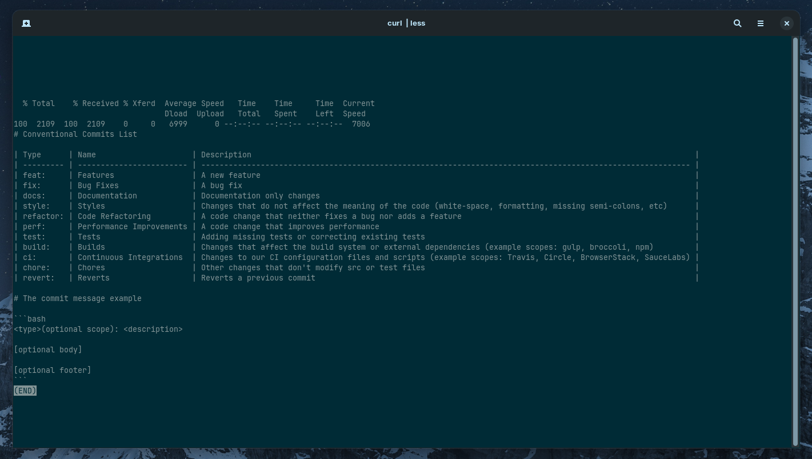

<div align="center">
  
  <h1>CoCo</h1>
</div>

## What means CoCo

**C**o**C**o means **C**onventional **C**ommits and **C**o**C**o is coconut in Portuguese 🇧🇷. **C**o**C**o is a CLI table for show you all conventional commits in your terminal. I created this CLI becuse I every forget _What all onventional commits types?_ Now is here 😜

You can check the CoCo table in [github gist](https://gist.github.com/andre2l2/965b62efd1a5b24b6f83dc1cfdace7ac)

## Run

Test with the below command

```bash
curl -s https://gist.githubusercontent.com/andre2l2/965b62efd1a5b24b6f83dc1cfdace7ac/raw/f2a850ffd7db4c0b8ea14fefa8ff9bd373b434aa/conventional-commits.md | less
```



## Install

### zsh

```bash
echo "alias coco=\"curl -s https://gist.githubusercontent.com/andre2l2/965b62efd1a5b24b6f83dc1cfdace7ac/raw/f2a850ffd7db4c0b8ea14fefa8ff9bd373b434aa/conventional-commits.md | less\"" >> ~/.zshrc && source ~/.zshrc
```

### bash

```bash
echo "alias coco=\"curl -s https://gist.githubusercontent.com/andre2l2/965b62efd1a5b24b6f83dc1cfdace7ac/raw/f2a850ffd7db4c0b8ea14fefa8ff9bd373b434aa/conventional-commits.md | less\"" >> ~/.bashrc && source ~/.bashrc
```
